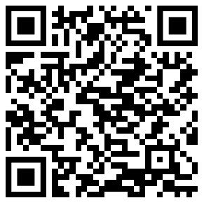

# Thank you!

 

## Questions?

 

## Reach out
* About this talk, AppSec, or raising chickens: 
  * xenloops [at] protonmail [dot] com
  * Signal: xenloops.47
  * LinkedIn: [https://www.linkedin.com/in/securenathanlarson](https://www.linkedin.com/in/securenathanlarson)
  * Complete talk at https://github.com/xenloops/talk-dogfood-pipeline-cd
  * 
* About the local OWASP chapter: 
  * [https://owasp.org/www-chapter-minneapolis-st-paul](https://owasp.org/www-chapter-minneapolis-st-paul)
  * nathan.larson [at] owasp [dot] org
  * Meetings are free and open!
  * Interested in giving a talk?
  * Want to help the local security community?

   

[References](references.md)
