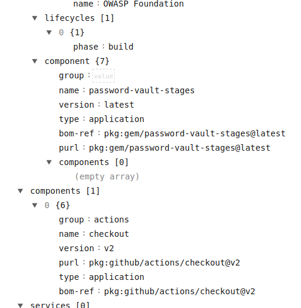

# Software Bill of Materials (SBOM)

The SBOM is a structured document that provides a comprehensive view of software components and their dependencies, aiding in software security, compliance, and risk management throughout the software lifecycle.

* List of all software components used in a software project
* Detailed inventory of components, libraries, dependencies, etc.
* Includes component names, versions, licenses, and dependencies

SBOMs are important to:

* Help track and manage software supply chain risks
* Help ensure software security, compliance, and transparency
* Facilitate vulnerability management, patching, and risk assessment by identifying known vulnerabilities in software components and their dependencies.
* Support software composition analysis (SCA) tools and practices

[Next slide](verify.md)
