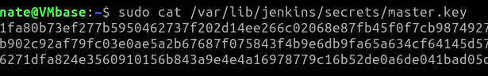

# Secrets Management

The secure handling, storage, and use of sensitive information required during the build, test, and deployment processes:

* API keys
* Passwords
* Cryptographic keys
* Other credentials

Managing secrets effectively is crucial to maintaining the security and integrity of the pipeline and the software being delivered.

<br /><br /><br /><br /><br /><br /><br /><br /><br /><br /><br /><br />

Why do we need secrets?

* At least to checkout the source code to build.
* Sign releases of the application using a code signing key.
* Deploying to each environment requires the credentials for that environment.
  (You're not using the same creds for dev/test/prod, are you?)
* Updating the issue tracker with details of relevant Jenkins builds requires credentials for the issue tracker.


<br /><br /><br /><br /><br /><br /><br /><br /><br /><br /><br /><br />

Key aspects of secrets management in a CI/CD pipeline:

* Environment variables
* Secrets injection via pipeline
* Secret rotation

Protect secrets in a key vault:

* Secure storage
* Access control
* Audit trail
* Secrets masking (logging or other output)

<br /><br /><br /><br /><br /><br /><br /><br /><br /><br /><br /><br />

## A low-budget way -- Jenkins FTW!

Problem: Jenkins serializes plugin ```String``` fields to disk, including credentials!

* Other users can access the Jenkins home directory by default, bad news for credentials stored as plain text
* Backups of Jenkins home can be compromised, disclosing secrets
* String fields are round-tripped as plain text even if the value is hidden in a password field, so can be seen in the HTML page source

An easy solution: the Jenkins [```Secret```](https://javadoc.jenkins.io/hudson/util/Secret.html) class

* Glorified ```String``` that uses encryption in its persisted form
* Decryption key for secrets is stored in the ```secrets``` directory, which has the highest protection
* Exclude the ```secrets``` directory from backups
* ```Secret``` fields are round-tripped only in their encrypted form

<br /><br /><br /><br /><br /><br /><br /><br /><br /><br /><br /><br />

## A better solution: the Jenkins [Credentials plugin](https://plugins.jenkins.io/credentials)

* A UI for users to manage the credentials available to Jenkins.
* Integrates with internal or external credentials stores.
* Easy password rotation! (Employee change, password leak, IT-imposed change)


<br /><br /><br /><br /><br /><br /><br /><br /><br /><br /><br /><br />

Internal secrets storage takes extra care

* The internal store is stored in the JENKINS_HOME directory.
* The internal store is encrypted using a key that is also stored in JENKINS_HOME.
* The JVM running Jenkins must have access to these files.
* Apply all of the recommendations in [Securing Jenkins](https://wiki.jenkins.io/display/JENKINS/Securing+Jenkins).
* No builds on the controller (ideally zero executors).
* Secure the Jenkins filesystem. Jenkins uses strong encryption, but has to store the key somewhere...

<br /><br /><br /><br /><br /><br /><br /><br /><br /><br /><br /><br />

Jenkins key storage
* Recall how security by obscurity isn't security?
* Cryptographic key can't be encrypted (how would its unlocking key be stored?)
* **Literally** the key to the kingdom is in /var/lib/jenkins/secrets/master.key
* Make sure no one can read this file!



[Next slide](sbom.md)
